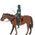
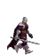
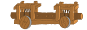

# FreeSiege

FreeSiege is a puzzle block war game for two players.

Swap blocks to build specific patterns and send ferocious soldiers toward the enemy castle.

## Controls

Default controls:

|              | Player 1 | Player 2 |
|--------------|----------|----------|
| **Up**       | Up       | E        |
| **Left**     | Left     | S        |
| **Down**     | Down     | D        |
| **Right**    | Right    | F        |
| **Select**   | O        | Q        |
| **Swap**     | O        | Q        |
| **Validate** | P        | W        |

The default controls are keyboard layout-independent, which means that regardless of
the layout that you are using (e.g. AZERTY or Dvorak), they are located as if
it were QWERTY.
You can configure controls using the Options>Keys menu.

You can also use joysticks (D-pad and button A and B will be used).

As you may have noticed it’s possible to map Select and Swap action to different buttons, but most players will want to map them to the same key.

## Units and patterns

Units are described below. To find out their patterns, please use the "Patterns" menu entry ingame.

### Soldier

Basic unit, fight opponents when they touch them. Deal a small amount of damage when reaching opponent castle.

### Knight

This unit can be blocked only by a golem or a veteran. Therefore it is the best solution to damage the other player and wound small ground unit. It is quite fast so it can avoid druid's cannon ball.

### Veteran

This unit blocks other units. This is a good way of pushing the front near the enemy castle, for instance for protecting a ram.

### Ram

Very slow and weak unit, but it deals a big amoung of damage to the opposite castle. This unit is the one dealing the most damages

### Plant

This is a defense unit, staying in front of your castle and blocking almost every one.

### Druid

The druid is a big cannon mounted on your castle. When activated it shoot three round of explosive cannon ball. When those ball reaches the ground they explode dealing a large amount of damage to the neighboring units. However if the ball touches an unit before touching the ground, it doesnt explode and kill instantly. Since it was invented by a mad scientist it is not very precise and cannon balls damage both player's units. Use with caution!

### Golem

Very powerfull unit, but very slow too. It doesn't deal a big amoung of damage to the opposite castle but it blocks every unit that fights with him. When he dies, an explosion takes place due to the fall of his huge body on the battlefield. It is the strongest defense unit in freesiege.

### Dragon

Very powerfull unit, it flies overs enemies. The only way to stop it is using the druid.

### Marion

This is not a unit, it just spawns a lot of flying flowers over the enemy screen to distract him.

## Building

To build FreeSiege you will need the SDL2, SDL2_mixer, SDL2_ttf and SDL2_image development libraries.

You can then run `cmake .` and then `make` to build the game, and `make install` (as root or
sudo) to install it system wide.

## License

FreeSiege source code is distributed under the GNU General Public License, version 3, or
(at your option) any later version (GPL-3.0+).
See the AUTHORS file for credits and licenses of data.

For more information, feedback or feature request about the game, go to <http://github.com/MCMic/freesiege>
